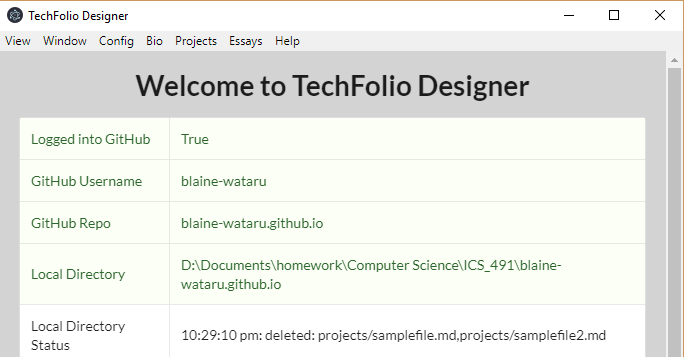
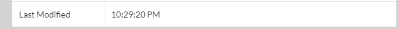
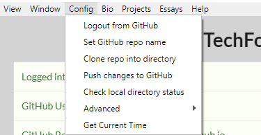
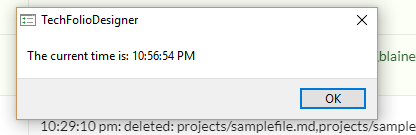
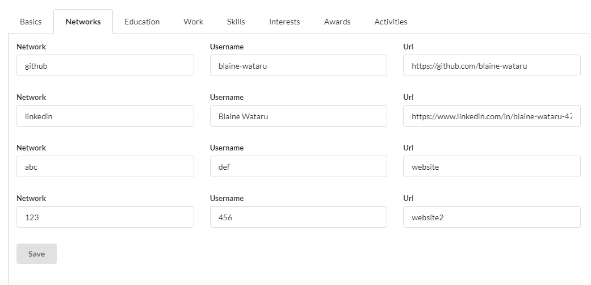
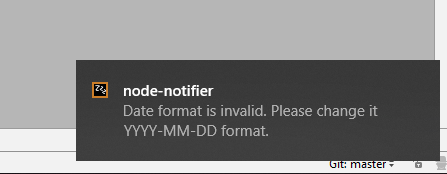

## Introduction

Reload4
I recently started developing for Techfolio Designer, and was assigned to tackle this [issue](https://github.com/techfolios/techfoliodesigner/issues/22) (along with my classmates) for my ICS 491 class. In this essay, I'll be documenting my experiences with solving the given problems.

## How I solved the problems

Coming into development, I knew absolutely nothing about React, and was somewhat rusty on my JavaScript, HTML, and CSS. I spent a good amount of time going over tutorials and doing a bunch of reading online. As a result, solving these problems took me a lot more time than it probably should've. If you wish to learn more about the problems, read the issue linked above.

### Change background color of Splash Page

  

This was fairly simple, it just involved changing the "body" tag of the SplashPage.html file.
  
### Add Last Modified timestamp to Splash Page

  

I couldn't create a seperate LastModified component that updated when either the SplashLog was written to or the SplashTable updated. I instead opted to have a LastModified field in the SplashTable that updated whenever the SplashTable updated, saving the time using moment.js. This mostly covers all cases anyway, as often the log will not update without the table updating as well. 

### Add menu item to Config menu

  

I first needed to find the config menu, which ended up being placed in its own "ConfigSubMenu.js" file. Then, I added all the necessary pieces and functions to add a new option to the menu. This was the easier part. I did have some trouble, howver, with writing the actual option functionality. I used the same moment.js functionality from Problem 2, but I needed to figure out how to create the dialog window. I looked at the codebase and found I could use dialog.showMessageBox() to do what I needed.

### Add simple validation to Set Github Repo name. 

  

I had to go back to the configSubMenu.js file for this problem. For here, I knew I needed to pull the value of the Github Repo name from the setRemoteRepo function and parse it to see if it contained "github.io". I thought of the Java code: "!repoName.get(value).contains("github.io") and found the equivalent in JavaScript to be: !repoName.valueOf('value').includes('github.io'), which I threw into an if condition to solve this problem.

### Allow four networks in the Simple Bio Editor

  

This one was simple in practice. I simply had to modify the SimpleBioEditorTabNetwork.jsx file to include 4 network fields instead of 3. However, I created a bug with how the URLs were saved: the bioEditor would overwrite url3 with the information from url4, leaving the actual url4 field blank and overwriting url3's data. I thought that perhaps the array needed to be expanded, as it was written so that any extra data that wouldn't fit into the array would overwrite existing data. However, I couldn't find any code that initialized the size of the array, leading me to guess it was dynamically allocated. In retrospect, if the array size wasn't large enough, then all the data for network4 would overwrite that of network3, not just the urls.

In the end, the bug happened to be a typo with my code. I was saving the information in url4 on top of url3, by writing a url3 when it should've been url4. 

### Perform simple validation on Project and Essay files

  

I had the most trouble solving this problem. My professor suggested to use an NPM YAML front-matter parser, which I did. However, I found that the JSON created ended up automatically converting the information in the Date field from YYYY-MM-DD to standard date format. This meant I had to regex to check for standard date format instead of YYYY-MM-DD format. However, I think this is OK as the parser will only convert to standard date format if the original date is in YYYY-MM-DD format. I then used the node-notifier package to create notifications, as I found the dialog.showMessageBox() functionality to not work correctly with a seperate Browser Window (such as the one created by the editor). 

## Conclusions

Doing these problems to prepare for Techfolio Designer development proved to be a lot more challenging than it probably should've been for me, which makes me slightly concerned about how developing will be in the near future. Hopefully I can build my knowledge of both React and the TechfolioDesigner codebase to better be able to solve problems and contribute to the project.

