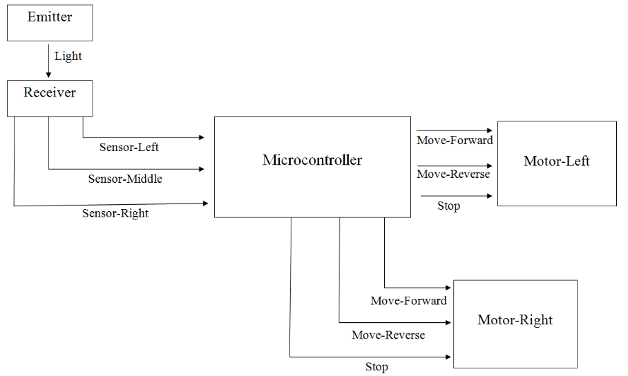

  
  

Micromouse is an engineering competition held worldwide. Participants construct an autonomous robot (the "mouse") which attempts to solve a 16x16 maze in the shortest amount of time possible. The maze is considered solved when the mouse travels from the edge of the maze to the center without traveling over the maze walls or destroying the maze in any way. The mouse can be up to a maximum of 25 x 25 cm with a budget of $500.

As this was only our sophomore project, our goal was simply to create a mouse that could solve the maze in any amount of time. To do this, we chose a brute-force mouse design called a "Right-wall-hugger", which would make a right turn whenever the oppurtunity presented itself, in essence "hugging" the right wall. Unfortuantely. we weren't able to achieve this goal due to techinical difficulties on the software side of our project. The most we were able to achieve was a mouse that could make right turns and go straight. A lot of our thought process went into the hardware side, so we ended up with not enough time to properly develop the software side. We possibly could've scheduled time better to finish the hardware earlier or devoted more resources to the software side. The mouse's hardware was working correctly and designed fairly well, we were simply unable to complete the software side.

Schematics:

Block Diagram:

  
I was on the hardware side of our team. My job was primarily to construct the mouse, through usage of soldering, wiring, and circuitry, and developing a design for the mouse. We used a multi-tiered design which would allow easy access to the circuity for fixes and modification. The top layer was primarily the circuitboard, the middle layer held the sensors, and the bottom layer was the base, containing the motors and the wheels. 

More information about the Micromouse project: [UH Micromouse Website](http://www-ee.eng.hawaii.edu/~mmouse/about.html).

