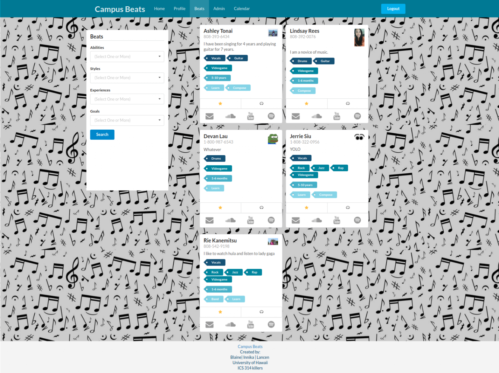

## Introduction

You can view our project page [here](https://campusbeats.github.io/).

In summary, CampusBeats is a web app I developed using [Meteor](https://www.meteor.com/) in a team of 3 consisting of myself, and my classmates at UH Manoa: Innika Pang and Lancen Daclison. It's primary purpose was to allow users to create profiles of their musicianship, giving their musical abilities, experience, styles, goals, and searching for other musicians using those attributes in order to connect and collaborate with each other. Over a month, we managed to get the app's base functionality working, but were unable to complete our vision for the project due to time constraints. Still, I learned a lot about software development and design, collaboration, and version control using platforms such as IntelliJ IDEA, Meteor, and GitHub, as well as working with languages such as CSS, JavaScript, and HTML.

## Goals, Accomplishments, and Reflections

Our primary goal was to develop CampusBeats with its base functionality, as well as adding extra features such as admin controls (including monitoring content, banning inappropriate users, making new search items, etc.), external integrations with SMS messaging, mobile versions, and an event calendar. However, we only managed to realize some of these visions due to lack of time and technical knowledge. In the end, we were only able to get the base functionality of the app, some of the admin controls, and the event calendar to function properly. 

If we were more experienced and given more time, I believe we would have been able to fully implement all of our ideas, and would have liked to have been able to do so. As it stands, the app is functional, but incomplete. However, I am still proud of all we were able to accomplish, and would like to have the oppurtunity to work on something similar in the future.

In doing this project, I strongly developed my software engineering and developing skills. I learned how to use GitHub to manage collaboration and version control. I gained an understanding of what makes a good website, and the differences between my website and industry leaders like FaceBook and Google. I learned new languages like HTML and JavaScript, and how they interact together on a webpage. I learned how to create a website using Meteor. There were a lot of useful things I learned, and I hope they help me in my technical career in the future.
  
## Responsibilities

You can view my issues I worked on [here](https://github.com/campusbeats/campusbeats/issues?q=is%3Aissue+is%3Aclosed), but we also did a lot of collaborating and helped each other out if someone got stuck on their own issue. In summary, I was primarily involved with coding the backend of the web app in JavaScript. I implemented the calendar and search algorithm, added the collections and collection logic, and worked together with my team to design the admin controls. I also drew up our basic designs and layouts for our web app, which Innika then realized into our final webpage designs, but I mostly ended up working on the JavaScript backend of the app rather than the page design involving HTML, CSS, and Semantic UI.

The pages I developed:

  
  
  

