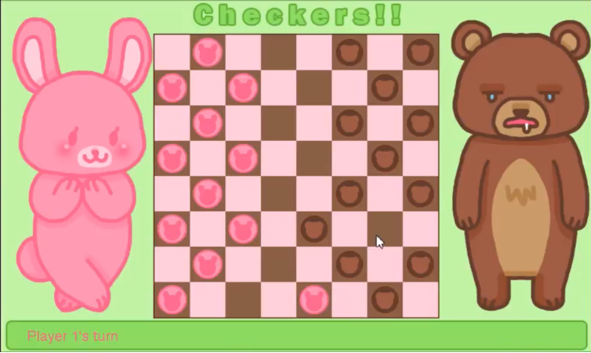

## Introduction

In ICS111, I, along with my partner Grace Jung, created a game of checkers with help from [EZ](http://www2.hawaii.edu/~dylank/ics111/), provided to us. Our game follows the rules of Checkers to the letter, and is playable with 2 players only. This project helped me learn how to collaborate in a development environment, the basics of programming in Java, and how to design, develop, and debug games. Our project was selected as one of the best projects out of our ICS111 class.

## Responsibilities

My responsibility was primarily the game logic (regarding the valid movement of pieces, capturing logic, etc.) and debugging the code. It was particularly challenging to debug, as there were many fringe case bugs caused by incorrect logic, and our algorithm may or may not have been the optimal solution. Nevertheless, we managed to get the game working and debugged it as best we could, but there were possibly some other fringe cases that we did not encounter in our testing.

## Reflections

I think it's possible that we could've developed a better algorithm for our board logic rather than having to run checks on each piece to see what valid squares it could move to, possibly something that coudld cut down on the fringe case bugs and have been more simpler to implement. I also would've liked to have had some more features, particularly displaying possible moves on the board, or an AI opponent. Overall, I learned a lot about game development, programming in Java, and collaboration.

Links below: (May need [Eclipse](http://www.eclipse.org/downloads/packages/eclipse-ide-java-developers/keplersr1) to run)
  
[Github](https://github.com/blaine-wataru/ICS111Checkers)  

[Dropbox](https://www.dropbox.com/s/9m2owgbckxr6d91/CheckersICS111.zip?dl=0)  

Youtube Demo: 

