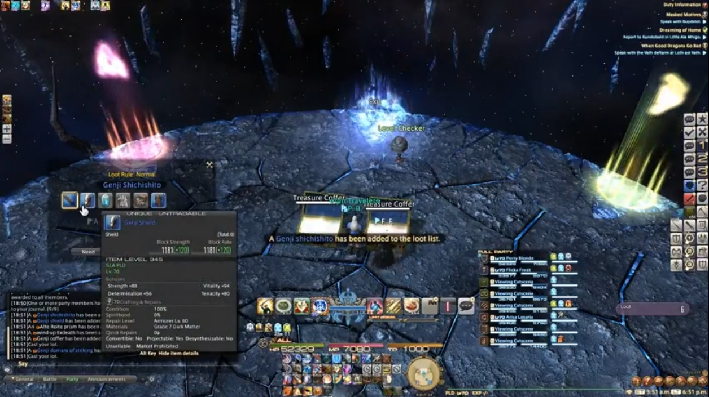

## Introduction

In 2016, I became a raid leader for a online game called Final Fantasy XIV, which was a leader of a group of like-minded indivduals who banded together to defeat powerful AI opponents (i.e. raiding). Raiding in games like Final Fantasy XIV and World of Warcraft can teach a multiple of very important skills that are very applicable to the real world, and leading a raid group has definitely shaped my personality tremendously.

When I first joined Final Fantasy XIV back in 2015, I had no idea I would grow to be a competitve player, pushing for the top 1% of the 1% of all players. But as low to mid level content became "easy" I began pushing further and further to attempt to challenge myself with the game. I joined a raid group on a whim, and was introduced to an entirely different world: a world of optimization, perfect synchronization, and comradarie. I learned and reinforced skills like communication with your team to figure out the best way to handle a problem, making mistakes, owning up to them, and not making them again, doing your homework so you were prepared as to not waste everyone's time, and showing up on time, every time. 

## Responsibilities

The group I led was never a highly-competitve group, but we still followed these raiding principles. However, as a raid leader, I had to take up additional responsibilities. To put together my group, I searched Reddit, asked around, and advertised in game. I interviewed potential applicants and tested out their skills, taking only the best players I could find. 

I scheduled our raid times according to when people were available, and asked around for substitutes if players could not make it for any particular real-life reasons. 

I also was the main shotcaller inside of raid. I called out boss mechanics and made strategies together with my team in order to help us understand the bosses and defeat them. If changes needed to be made, we adjusted as best as we could and came up with new, better strategies. I also kept people in line, particularly if someone was arguing unnecessarily, being rude or mean to others, or being distracted or distracting.

Another thing I had to deal with as a raid leader was tensions created as a result of personality clashes between members. We had a particular problem with one member who did not follow our principles and was not meeting expectations. As a result, I had no choice but to remove her from the group as delicately as I could, in hopes of preventing backlash from her.

## Summary

In summary, I learned many management skills from raid leading, such as recruiting, scheduling, firing people, and keeping people in line, as well as other skills like communicating, learning from mistakes, not wasting people's time, and punctuality.

