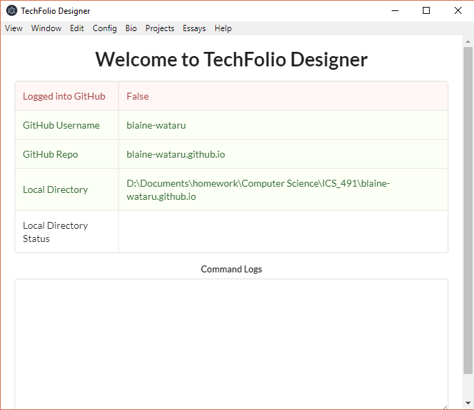
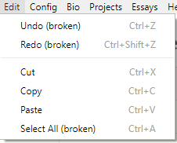
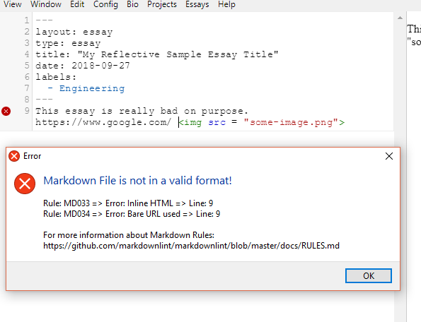

 

## Introduction

For my Fall 2018 semester at UH Manoa, I worked on a project developed initially by [Philip Johnson](http://philipmjohnson.org/) called [Techfolio Designer](https://techfolios.github.io/techfoliodesigner/) (Project Repo [here](https://github.com/techfolios/techfoliodesigner/)). Essentially, Techfolio Designer is an app that allows students to create and edit their own online portfolios without directly interacting with the raw files on GitHub, making things smoother and easier for them. Techfolio Designer is built using [Electron](https://electronjs.org/), which allows users to build Desktop apps using Web Design principles and frameworks like JavaScript and npm. Communication and coding was done through GitHub, GitHub Issues, Slack, and weekly meetings.

## Accomplishments

- Implemented standard editor functionalities such as Cut/Copy/Paste/Select All/Undo/Redo. Unfortunately, I wasn't able to get the functionality to work in the menu for some options (although it does work on the hotkeys). There have been marked with the (broken) subtag.
- Implemented a custom text checker that would parse student's saved essays for common errors, both relating to the quality of the essay, and any common markdown errors.

## Thoughts

My thoughts in detail can be read [here](https://blaine-wataru.github.io/essays/techfolios.html) and [here](https://blaine-wataru.github.io/essays/techfoliodesignerexperience1.html). In essence, working on Techfolio Designer allowed me to gain further insight into how a software team functions, gain skills in developing desktop apps, and brush up on JavaScript. I found desktop apps function differently from web apps, due to the possiblities of multiple windows, custom right click menus, access to the OS, and hotkeys. This allows more functionality and options in controlling the app, as compared to a web app which is locked to one window and standard browser controls and conventions.

  
  

